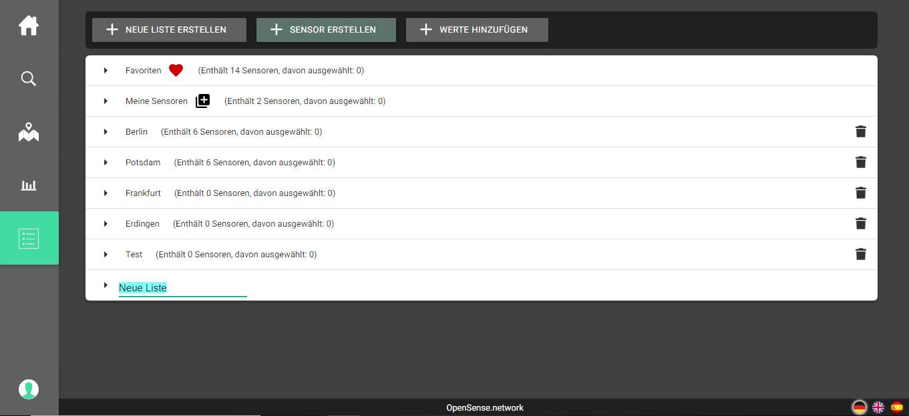

#### OpenSense Dashboard 

Orginal github project 
https://github.com/furnya/OpenSense-Dashboard-Project

Anleitung mit AWS Server verbinden:

1. Möglichkeit (nur für Windows):
1.	Download PuttyTools (https://www.putty.org/)
2.	PuttyGen öffnen 
3.	Key (opensense-dashboard-server.pem) laden und als private key im SSH-2 RSA-Format speichern
4.	Putty öffnen neue Session erstellen mit Host ec2-18-233-98-118.compute-1.amazonaws.com
5.	Bei Authentifikation private key angeben
6.	Bei Tunnels zwei ports weiterleiten (siehe Seite 2)  127.0.0.1:3306 auf 3305 und 127.0.0.1:8080 auf 6060
7.	Speichern und verbinden als ubuntu

2. Möglichkeit mit SSH (Mac und Linux):
1.	SSH-Client herunterladen
2.	Konsole öffnen und folgenden Befehl eingeben mit Pfad zur .pem Datei ssh -i .ssh/opensense-dashboard-server.pem -L 3305:127.0.0.1:3306 -L 6060:127.0.0.1:8080 ubuntu@ec2-18-233-98-118.compute-1.amazonaws.com
	
Auf der Maschine laufen die beiden Docker Container. Mit dem ersten Tunnel verbindet sich Eclipse mit dem MySQL Container und der zweite ist um das gesamte Projekt im Browser über die Container zu starten (wie bereits angesprochen läuft dieser nicht so stabil und bug frei wie in Eclipse). Dieser kann bei offener Verbindung mit http://127.0.0.1:6060/opensense/ geöffnet werden	
Anleitung Eclipse Projekt einrichten und starten:
1.	Git projekt clonen oder runterladen https://github.com/furnya/OpenSense-Dashboard-Project.git
2.	In Eclipse existierendes Projekt importieren
3.	Eventuell ist es notwendig unter Help -> Eclipse Maketplace die GWT SDK 2.8 zu installieren 
(3.) Wir haben außerdem im Maketplace SonarLint installiert. Hat uns bei der validierung und Verbesserung von unserem Code sehr geholfen
4.	Maven sollte GWT ansonsten auch installieren: Rechtsklick auf das Projekt -> Run as  -> Maven install
5.	Environment variablen eingeben (siehe Seite 2) unter: Rechtsklick auf das Prjekt -> Run as -> Run configurations -> Environment tab 
6.	Argumente eingeben im Tab „Arguments“ vor allem um für die VM mehr Speicher freizuhalten ((siehe Seite 2) -Xmx1g -Xmx2g -Xmx3g -Xmx4g
7.	Projekt starten mit Run as -> GWT Development Mode with Jetty 
8.	Projekt unter dem Link aufrufen http://127.0.0.1:8888/OpenSenseDashboard.html
Das Projekt läuft mit Java 8 und funktioniert am besten mit der jdk1.8.0_191 (GWT ist sehr wählerisch mit den Versionen, gut möglich, dass es mit einer neueren Version nicht funktioniert). Wir haben uns beim Server sowie bei der SQL-Datenbank nicht besonders mit dem Thema der Sicherheit auseinandergesetzt (es gibt immer nur einen Nutzer, der alle Rechte besitzt).

### Demo Sceenshots und Video

<video width="320" height="240" controls>
  <source src="assets/demo.mp4" type="video/mp4">
</video>

